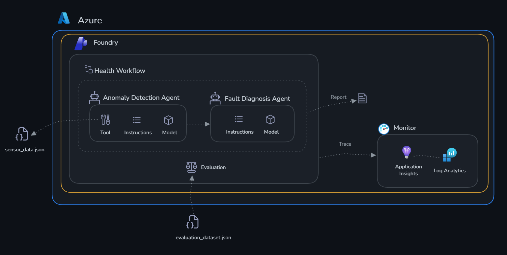

# Challenge 4: Orchestrate and deploy

Time: ~20 minutes

## Objectives

By the end of this challenge, you will have:

- ✅ Chained the anomaly agent and the diagnosis agent in code with Microsoft Agent Framework
- ✅ Approved or rejected a work order before the agent created it (human in the loop)
- ✅ Deployed the orchestration to Foundry as a hosted agent



> [!NOTE]
> The visual workflow designer in the Foundry portal retires on **1 December 2026**. Microsoft recommends
> Agent Framework for new multi-agent work, so this challenge builds the orchestration in code.
> See [Build a workflow in Microsoft Foundry](https://learn.microsoft.com/azure/foundry/agents/concepts/workflow).

## The flow

```
anomaly-detection-agent  -->  fault-diagnosis-agent  -->  create_work_order
   (check_thresholds)            (root cause, urgency)       (you approve or reject)
```

| File | What it does |
|------|--------------|
| `factory_orchestration.py` | The two agents, their tools and the sequential orchestration |
| `run_local.py` | Runs the orchestration in your terminal |
| `main.py` | Entry point Foundry runs when the orchestration is a hosted agent |
| `chat_hosted.py` | Chats with your hosted agent from the terminal |
| `requirements.txt` | Packages Foundry installs for the hosted agent |

All files are in the [factory-health-agent](./factory-health-agent/) folder.

---

## Part 1: Run it locally

### Step 1: Review the code

Open [factory_orchestration.py](./factory-health-agent/factory_orchestration.py) and find:

- **`check_thresholds`**: compares each machine's readings with its limits.
- **`create_work_order`**: marked `approval_mode="always_require"`, so a person must approve each call.
- **`build_workflow()`**: chains the two agents with `SequentialBuilder`. The diagnosis agent gets the anomaly report as text.

### Step 2: Run the health check

```bash
cd factory/challenge-4-deploy/factory-health-agent
python run_local.py
```

The anomaly report prints first. Then the diagnosis agent asks to open a work order for the critical machine:

```
[APPROVAL NEEDED] create_work_order {"machine_id": "CP-003", "urgency": "IMMEDIATE", ...}
Approve? [y/N]
```

Type `y`. The final report quotes the new work order ID, for example `WO-CP-003-...`.

### Step 3: Reject a work order

Run `python run_local.py` again and type `n`. The report now says the work order was rejected.

---

## Part 2: Deploy as a hosted agent

Foundry runs your code in a managed sandbox. You don't need Docker or a container registry.

> [!IMPORTANT]
> You need the **Foundry Project Manager** role on your project. If you don't have it, stop after Part 1.

### Step 4: Sign in

`azd` uses its own sign-in. Tell it to reuse your Azure CLI sign-in:

```bash
azd config set auth.useAzCliAuth true
```

On your own laptop, also run `azd ext install azure.ai.agents`. Codespaces already has it.

### Step 5: Set up the agent

From the `factory-health-agent` folder:

```bash
azd ai agent init --src . --agent-name factory-health-<yourname>
```

Answer the prompts:

| Prompt | Answer |
|--------|--------|
| Foundry project | Use an existing Foundry project, then pick your subscription and project |
| Model | Use an existing model deployment, then pick `gpt-5.4` |
| Protocol | `responses` |
| How to deploy | Source Code (ZIP upload) |
| Runtime | Python 3.13 |
| Entry point | `main.py` |
| Build | Remote build |

### Step 6: Deploy

```bash
azd deploy
```

The first deploy takes about 2 minutes while Foundry installs the packages.

### Step 7: Chat with your hosted agent

```bash
python chat_hosted.py factory-health-<yourname>
```

Approve the work order as before. This time `create_work_order` runs inside Foundry, not on your machine.

In the [Foundry portal](https://ai.azure.com), select **Build** → **Agents** to see your hosted agent and its traces.

---

## Success criteria

- [ ] `run_local.py` creates a work order when you approve and reports a rejection when you don't
- [ ] Your multi-agent orchestration runs as a hosted agent in Foundry
- [ ] `chat_hosted.py` gets an approval request from the hosted agent and returns a work order ID

## Clean up

```bash
azd ai agent delete --force
```

---

## Other ways to orchestrate

| Option | Use it when |
|--------|-------------|
| Agent Framework + hosted agent (this challenge) | Developers own the flow and want it in source control |
| [Azure Logic Apps](https://learn.microsoft.com/azure/logic-apps/automate-foundry-agents-with-workflows) | You want a visual designer and ready-made connectors |
| [Agent-to-agent (A2A)](https://learn.microsoft.com/azure/foundry/agents/how-to/enable-agent-to-agent-endpoint) | One agent only needs to hand off to another |

## Learn more

- [Sequential orchestration in Agent Framework](https://learn.microsoft.com/agent-framework/user-guide/workflows/orchestrations/sequential)
- [Deploy a hosted agent](https://learn.microsoft.com/azure/foundry/agents/how-to/deploy-hosted-agent)
